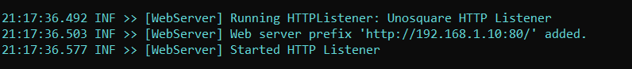

# Directory2Rss

Do you listen to MP3-based audio books on your phone?  Do you wish the audio books worked more like podcasts where the player remembers your place and you can skip back and forward like you do in a podcast or with Audible?  Me too!

This project allows you to temporarily host a user-specified folder on your hard drive as a podcast RSS feed.  Use your favorite podcast player to download your files to your phone and then quit the app.  Enjoy!

## Requirements 
* .NET Core 3.1 (Windows, Mac, Linux)
* Both device and PC must be on the same network
* Port 80 open on your PC's firewall (Windows will give you an UAC prompt; Linux likely must open firewall manually)

## Usage
On Windows, run ```Directory2Rss.exe```
On Linux (assume Mac as well), run ```dotnet Directory2Rss.dll``` from the terminal.

Directory2Rss will then prompt you for the directory to serve, podcast title, podcast description, and podcast owner.  Defaults for each value are given in brackets (press enter to accept the default value):

```
Select IP address to bind:
...

Enter directory to serve [D:\directory2rss]:

Enter podcast title [Directory2Rss]:

Enter podcast description [A directory being served as a podcast RSS feed]:

Enter podcast owner [Directory2Rss]:
```

If you plan to stream just one audio book at a time, you will only need to alter the directory to serve (e.g. "E:\Music\Categorized\audio books\myBook").  You may need to change the other settings if you plan on downloading multiple books onto your device.

After all options are entered, you should see a message about the web server starting.  Take note of the IP address listed.  In the screen shot below, the IP address is 192.168.1.10.



To test locally on your PC, visit the IP address in your favorite web browser. You should see a link to the RSS feed (http://IP_ADDRESS/rss).  Use this address to add the podcast feed to your device.  Once all of the episodes are downloaded, kill the web server (CTRL + C).  From here, you should be good to go!
